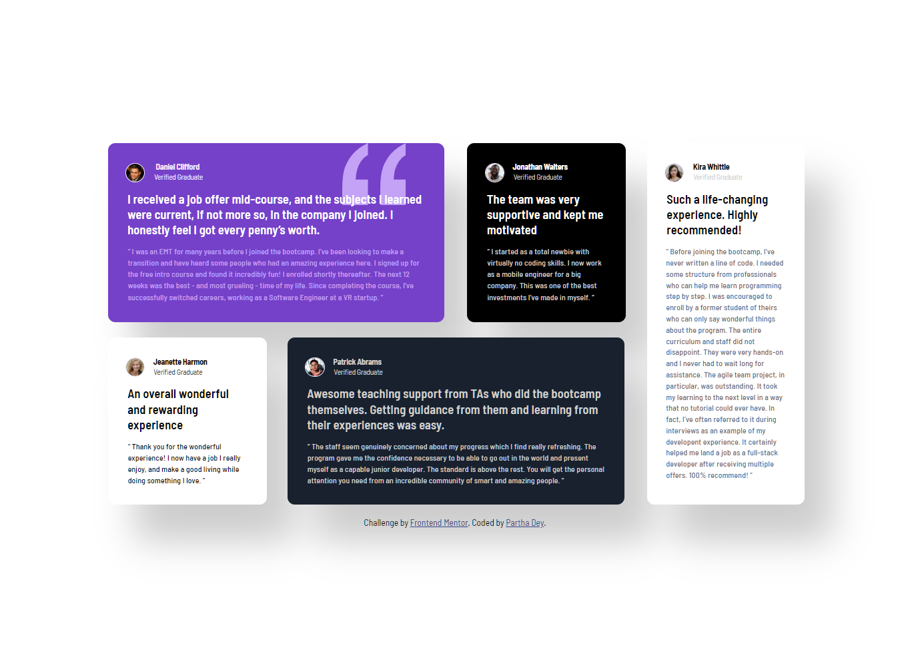

---

# Frontend Mentor - Testimonials Grid Section Solution

This is a solution to the [Testimonials grid section challenge](https://www.frontendmentor.io/challenges/testimonials-grid-section-Nnw6J7Un7).

## Table of contents
- [Overview](#overview)
  - [The challenge](#the-challenge)
  - [Screenshot](#screenshot)
  - [Links](#links)
- [My process](#my-process)
  - [Built with](#built-with)
  - [What I learned](#what-i-learned)
  - [Continued development](#continued-development)
  - [Useful resources](#useful-resources)
- [Author](#author)

## Overview

### The challenge
Users should be able to:
- View the optimal layout for the site depending on their device's screen size

### Screenshot

### Links
- Solution URL: [https://github.com/ParthaDey5/testimonials-grid-section-main]  
- Live Site URL: [https://your-live-site-url.com](https://your-live-site-url.com)

## My process

### Built with
- Semantic HTML5 markup  
- Tailwind CSS (all styling)  
- CSS Grid  
- Mobile-first workflow  

### What I learned
- Practiced responsive grid layouts with semantic HTML.  
- Reinforced px→rem conversion discipline for scalable typography.  
- Used Tailwind utilities to collapse complexity into repeatable patterns.  

### Continued development
- Refine grid responsiveness for edge breakpoints.  
- Explore accessibility improvements with ARIA roles.  
- Optimize Tailwind config for reusable tokens.  

### Useful resources
- [Tailwind CSS Docs](https://tailwindcss.com/docs) – Utility-first styling reference.  
- [CSS Tricks Grid Guide](https://css-tricks.com/snippets/css/complete-guide-grid/) – Clear explanations of grid behavior.  

## Author
- Website – [Partha](https://your-site.com)  
- Frontend Mentor – [@partha](https://www.frontendmentor.io/profile/partha)  

---

